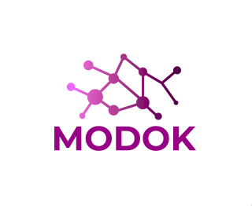

# MODODK -- A Chatbot for Restaurant Orders

## Foreword

This app consists of a server that accepts and processes http requests from twilio. These requests contain as payload the message sent to a certain whatsapp business account. The server then processes the request and the message and sends through the twilio API the response with which the whatsapp account should respond.

Therefore, this app is a CHATBOT. It's pretty basic and it can only receive orders for Paella, a spanish dish. Plus, the whole interface was written in spanish. I don't recommend using this app since it was coded to serve a specific use case which is automating my mother's business.

The app's architecture consists on a contextual pipeline, meaning that when a message arrives, the app runs the message through a pipeline that makes frequent calls to a state manager run with REDUX in order to properly decide what message to send. 
